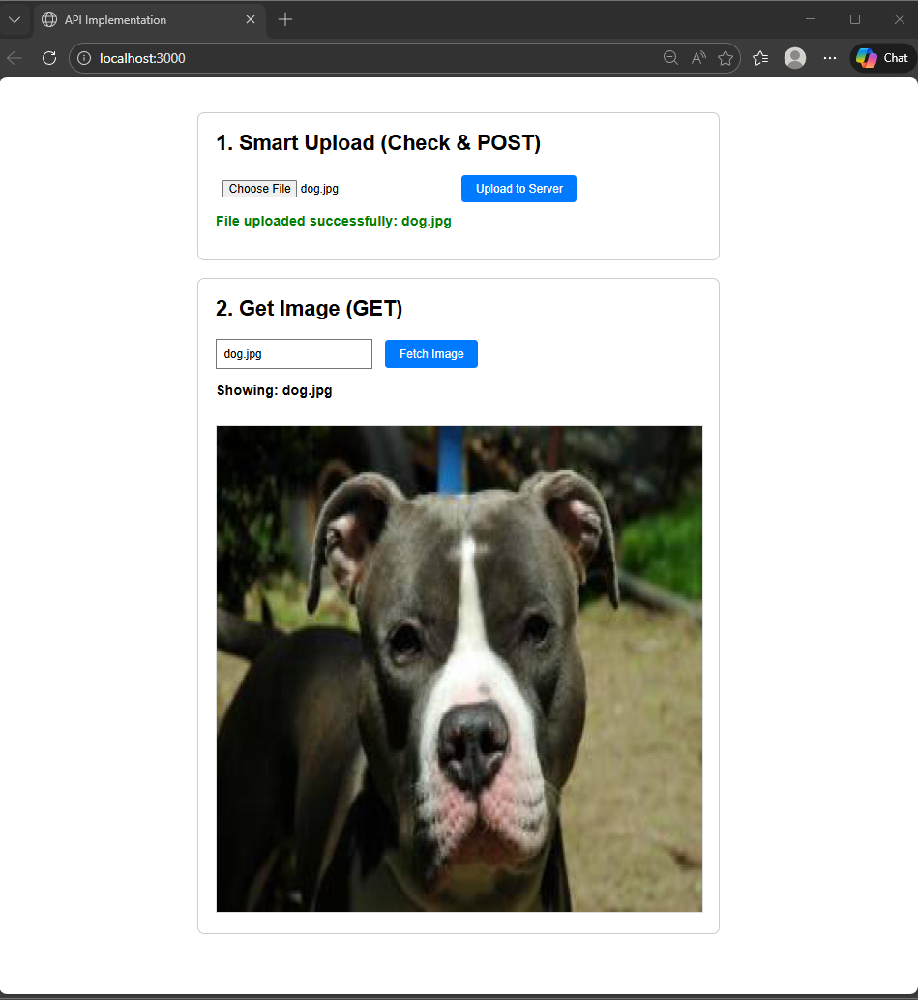
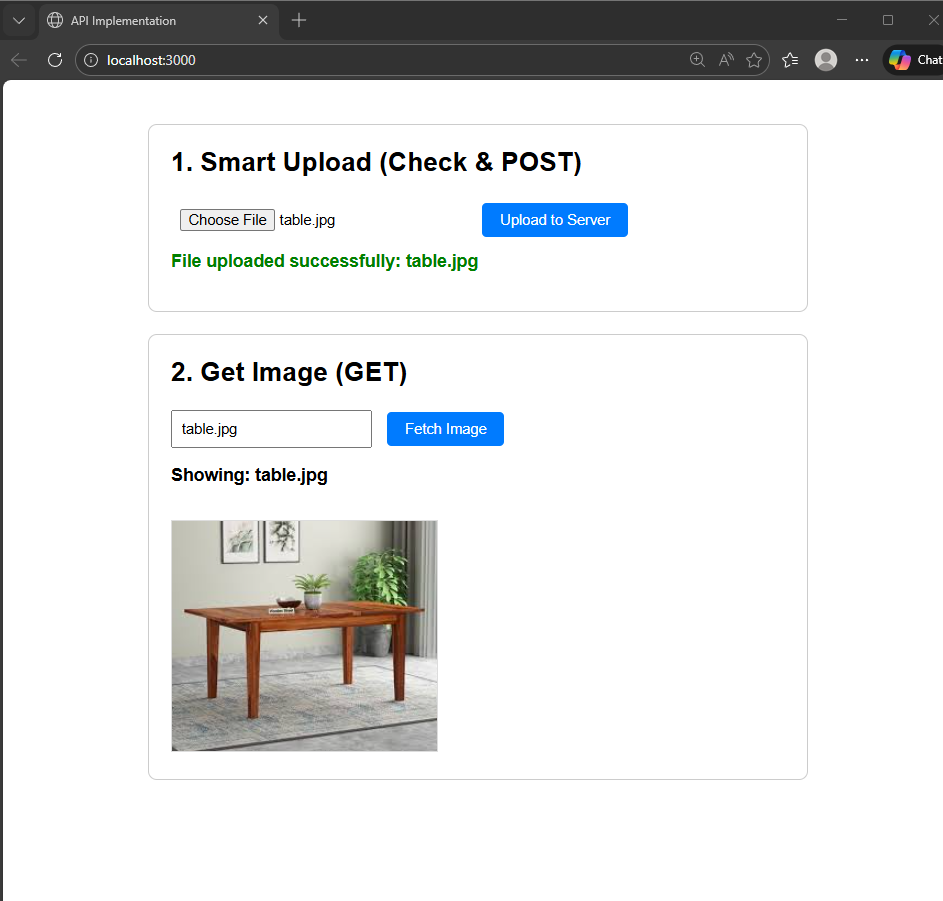

# API Implementation  
A simple client–server image upload and fetch system using POST (upload) and GET (retrieve).

---

## Features  
### ✔ Upload an image to the server (POST)  
### ✔ Fetch and display the image from the server (GET)  
### ✔ Smart UI showing upload confirmation and retrieved image  

---

## Screenshots  

### **1️⃣ Upload + Fetch (Dog Image Example)**  


---

### **2️⃣ Upload + Fetch (Table Image Example)**  


---

## API Endpoints

### **POST /upload**
Uploads an image to the server.

Body (form-data):
- `key`: API key  
- `image`: image file  

Response:
```json
{
  "message": "Image uploaded successfully",
  "filename": "dog.jpg"
}
